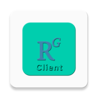

# ResearchGate-Client

### ResearchGate-Client: An unofficial web-based application built around the official https://www.researchgate.net/

## Download

## Features
* Easily and efficiently manage your https://www.researchgate.net/ account.
* Elegantly designed user interface with an auto-dark/light theme.
* No personal or private information about the users is collected.
* No Ads or trackers included.
* A lot more.

## License

    Copyright (C) 2021-2022 sunilpaulmathew <sunil.kde@gmail.com>

    ResearchGate-Client is a free softwares: you can redistribute it and/or
    modify it under the terms of the GNU General Public License as published
    by the Free Software Foundation, either version 3 of the License, or (at
    your option) any later version.

    ResearchGate-Client is distributed in the hope that it will be useful, but
    WITHOUT ANY WARRANTY; without even the implied warranty of MERCHANTABILITY
    or FITNESS FOR A PARTICULAR PURPOSE. See the GNU General Public License
    for more details.

    You should have received a copy of the GNU General Public License along
    with ResearchGate-Client. If not, see <http://www.gnu.org/licenses/>.
